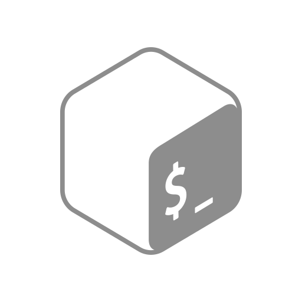
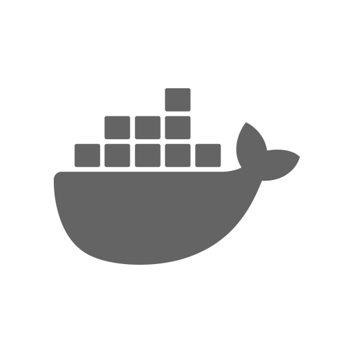

<div align="center">
  <p></p>
  <h1>LOGOMAIN</h1>
</div>

<table><tr><td align="center" width="99999"><p>
  <a href="https://olankens.com">WEBSITE</a> ·
  <a href="https://ko-fi.com/olankens">FUNDING</a>
</p></td></tr></table>

<table><tr><td align="center" width="99999">&nbsp;<p>
  Technology logo pack intended for very seamless integration into README.md files or other visual assets, provided as single SVGs with built-in full dark mode support for optimal flexibility and consistency.
</p>&nbsp;</td></tr></table>

<table><tr><td align="center" width="99999"><p>
  <a href="https://wikipedia.org/wiki/markdown"></a>
  <a href="https://wikipedia.org/wiki/svg"></a>
  <a href="https://figma.com"></a>
  <a href="https://cgit.git.savannah.gnu.org/cgit/bash.git"></a>
  <a href="https://github.com/features/actions"></a>
</p></td></tr></table>

### FEATURES

<!-- START_TABLE -->
<table>
  <tbody><tr>
    <td align="center" width="99999"></td>
    <td align="center" width="99999"></td>
    <td align="center" width="99999"></td>
    <td align="center" width="99999"></td>
    <td align="center" width="99999"></td>
    <td align="center" width="99999"></td>
  </tr></tbody>
  <tbody><tr>
    <td align="center" width="99999"></td>
    <td align="center" width="99999"></td>
    <td align="center" width="99999"></td>
    <td align="center" width="99999"></td>
    <td align="center" width="99999"></td>
    <td align="center" width="99999"></td>
  </tr></tbody>
  <tbody><tr>
    <td align="center" width="99999"></td>
    <td align="center" width="99999"></td>
    <td align="center" width="99999"></td>
    <td align="center" width="99999"></td>
    <td align="center" width="99999"></td>
    <td align="center" width="99999"></td>
  </tr></tbody>
  <tbody><tr>
    <td align="center" width="99999"></td>
    <td align="center" width="99999"></td>
    <td align="center" width="99999"></td>
    <td align="center" width="99999"></td>
    <td align="center" width="99999"></td>
    <td align="center" width="99999"></td>
  </tr></tbody>
  <tbody><tr>
    <td align="center" width="99999"></td>
    <td align="center" width="99999"></td>
    <td align="center" width="99999"></td>
    <td align="center" width="99999"></td>
    <td align="center" width="99999"></td>
    <td align="center" width="99999"></td>
  </tr></tbody>
  <tbody><tr>
    <td align="center" width="99999"></td>
    <td align="center" width="99999"></td>
    <td align="center" width="99999"></td>
    <td align="center" width="99999"></td>
    <td align="center" width="99999"></td>
    <td align="center" width="99999"></td>
  </tr></tbody>
  <tbody><tr>
    <td align="center" width="99999"></td>
    <td align="center" width="99999"></td>
    <td align="center" width="99999"></td>
    <td align="center" width="99999"></td>
    <td align="center" width="99999"></td>
    <td align="center" width="99999"></td>
  </tr></tbody>
  <tbody><tr>
    <td align="center" width="99999"></td>
    <td align="center" width="99999"></td>
    <td align="center" width="99999"></td>
    <td align="center" width="99999"></td>
    <td align="center" width="99999"></td>
    <td align="center" width="99999"></td>
  </tr></tbody>
  <tbody><tr>
    <td align="center" width="99999"></td>
    <td align="center" width="99999"></td>
    <td align="center" width="99999"></td>
    <td align="center" width="99999"></td>
    <td align="center" width="99999"></td>
    <td align="center" width="99999"></td>
  </tr></tbody>
  <tbody><tr>
    <td align="center" width="99999"></td>
    <td align="center" width="99999"></td>
    <td align="center" width="99999"></td>
    <td align="center" width="99999"></td>
    <td align="center" width="99999"></td>
    <td align="center" width="99999"></td>
  </tr></tbody>
  <tbody><tr>
    <td align="center" width="99999"></td>
    <td align="center" width="99999"></td>
    <td align="center" width="99999"></td>
    <td align="center" width="99999"></td>
    <td align="center" width="99999"></td>
    <td align="center" width="99999"></td>
  </tr></tbody>
</table>
<!-- CEASE_TABLE -->

### LEARNING

#### Creating Logo Banner

##### 1. Banner Preview

<table><tr><td align="center" width="99999"><p>
  <a href="https://angular.dev"></a>
  <a href="https://chromium.org/developers"></a>
  <a href="https://jetbrains.com/idea"></a>
  <a href="https://kotlinlang.org"></a>
  <a href="https://kubernetes.io"></a>
  <a href="https://spring.io"></a>
</p></td></tr></table>

##### 2. Gather the Logos

```sh
deposit=".assets" && mkdir -p "$deposit"
baseurl="https://github.com/olankens/logomain/raw/HEAD/source"
for f in {angular,chromium,intellijidea,kotlin,spring,kubernetes}; do
  curl -Lo "$deposit/$f.svg" "$baseurl/$f.svg"
done
```

##### 3. Create the Banner

```md
<table><tr><td align="center" width="99999"><p>
  <a href="https://angular.dev"></a>
  <a href="https://chromium.org/developers"></a>
  <a href="https://jetbrains.com/idea"></a>
  <a href="https://kotlinlang.org"></a>
  <a href="https://kubernetes.io"></a>
  <a href="https://spring.io"></a>
</p></td></tr></table>
```

#### Creating Logo Table

##### 1. Banner Preview

<table><tr>
  <td align="center" width="999999"><a href="https://angular.dev"></a></td>
  <td align="center" width="999999"><a href="https://chromium.org/developers"></a></td>
  <td align="center" width="999999"><a href="https://jetbrains.com/idea"></a></td>
  <td align="center" width="999999"><a href="https://kotlinlang.org"></a></td>
  <td align="center" width="999999"><a href="https://kubernetes.io"></a></td>
  <td align="center" width="999999"><a href="https://spring.io"></a></td>
</tr></table>

##### 2. Gather the Logos

```sh
deposit=".assets" && mkdir -p "$deposit"
baseurl="https://github.com/olankens/logomain/raw/HEAD/source"
for f in {angular,chromium,intellijidea,kotlin,spring,kubernetes}; do
  curl -Lo "$deposit/$f.svg" "$baseurl/$f.svg"
done
```

##### 3. Create the Banner

```md
<table><tr>
  <td align="center" width="999999"><a href="https://angular.dev"></a></td>
  <td align="center" width="999999"><a href="https://chromium.org/developers"></a></td>
  <td align="center" width="999999"><a href="https://jetbrains.com/idea"></a></td>
  <td align="center" width="999999"><a href="https://kotlinlang.org"></a></td>
  <td align="center" width="999999"><a href="https://kubernetes.io"></a></td>
  <td align="center" width="999999"><a href="https://spring.io"></a></td>
</tr></table>
```